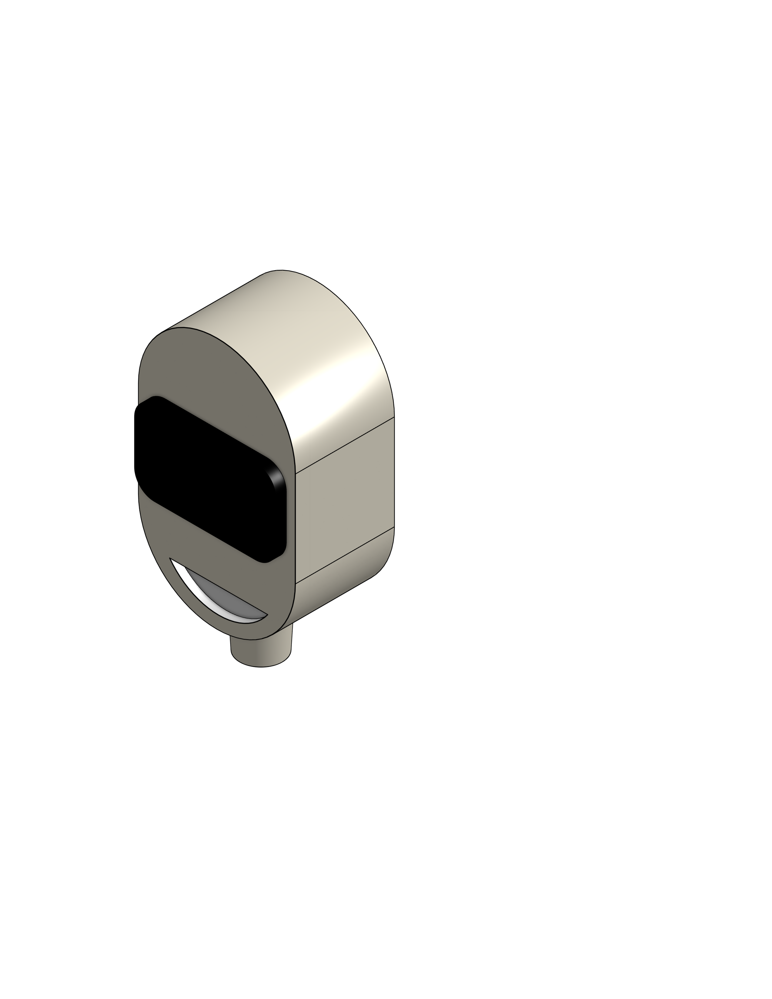
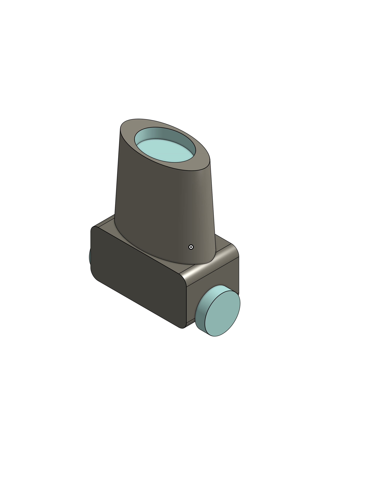
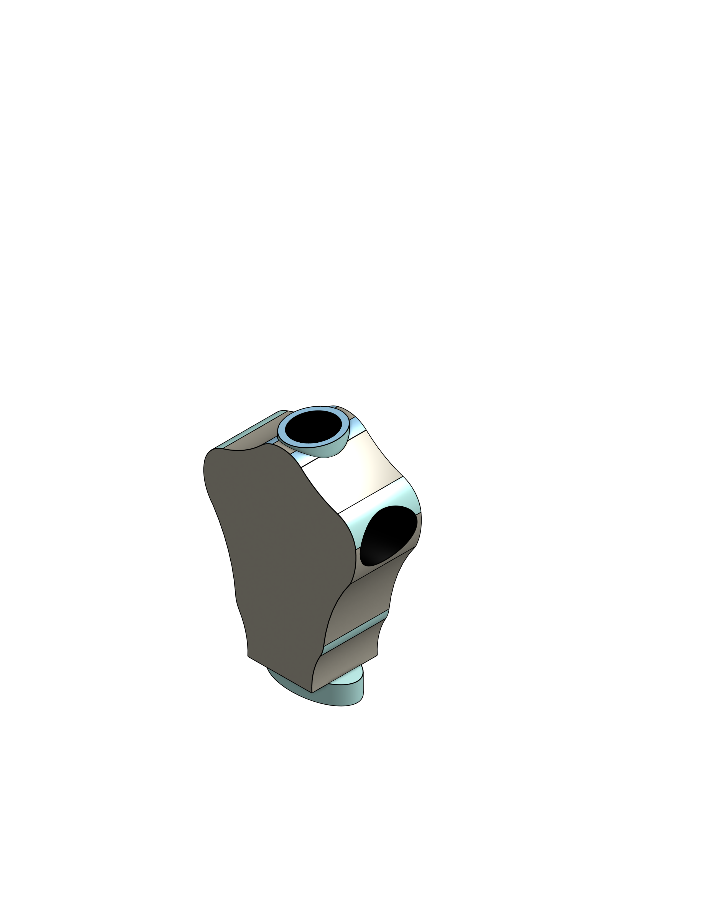
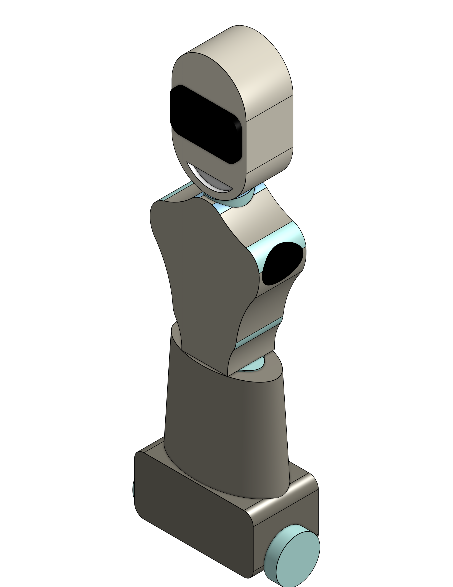

# MechanicalEngineering-Task2-robotDesign
<h4>In this task, I designed a model of a coffee holder robot. 
I used the "onShape"site to design each piece of the robot. 
I used the same website to collect the pieces</h4> 

<h3>Head</h3> 

<h3>base</h3> 
 

<h3>body</h3> 

<h3>full robot</h3> 

